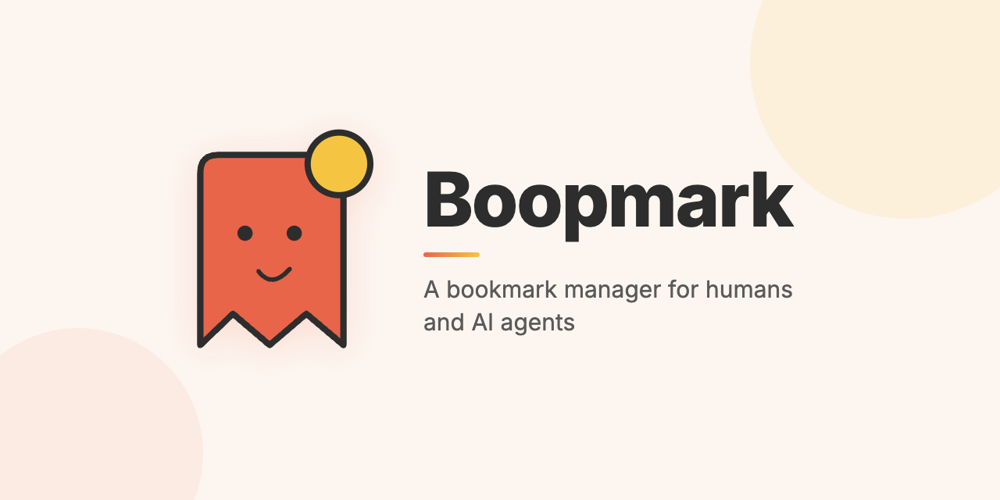

<p align="center">
  
</p>

<p align="center">
  <strong>A fast, self-hostable bookmark manager for humans and AI agents.</strong>
</p>

<p align="center">
  <a href="LICENSE"></a>
  <a href="https://github.com/willisrocks/boopmark/releases"></a>
  <a href="https://github.com/willisrocks/boopmark"></a>
</p>

<p align="center">
  Built with Rust, HTMX, and Tailwind CSS. Save, tag, and search your bookmarks from a clean web UI, a CLI (<code>boop</code>), or let your AI coding agents do it for you. Optional AI enrichment auto-generates tags and descriptions. Pluggable screenshot capture for page thumbnails.
</p>

---

## Installation

### For humans

Tell your AI coding agent:

> Read https://raw.githubusercontent.com/willisrocks/boopmark/main/README.md and follow the installation instructions.

Or follow the [Quick Start](#quick-start-self-hosting) and [CLI](#cli-boop) sections below.

### For AI agents

#### Claude Code plugin

Install the Boopmark plugin to give Claude Code the `boop` skill:

```bash
claude plugin add willisrocks/boopmark
```

This adds the `boop` skill, which Claude Code will automatically use when you ask about bookmarks.

#### CLI setup (all agents)

Any AI agent with shell access can use the `boop` CLI directly:

```bash
# 1. Install the binary
curl -fsSL https://raw.githubusercontent.com/willisrocks/boopmark/main/install.sh | sh

# 2. Point at your Boopmark server (local or hosted)
boop config set-server http://localhost:4000          # local dev
# or
boop config set-server https://boopmark.yourdomain.com  # your hosted instance

# 3. Get your API key: log in to the Boopmark web app → Settings → Generate API Key
boop config set-key YOUR_API_KEY

# 4. Verify
boop list
```

> **Important:** You need a running Boopmark server and a user account before the CLI will work. See [Quick Start](#quick-start-self-hosting) to set one up, then log in to the web app to generate your API key under **Settings**.

To give Claude Code (or any AI agent) access without the plugin, add this to your project's `CLAUDE.md` or `AGENTS.md`:

```markdown
## Bookmarks

Use the `boop` CLI to save and search bookmarks:
- `boop add <url> --tags "tag1,tag2"` — save a bookmark
- `boop search <query>` — find bookmarks
- `boop list` — list recent bookmarks
- `boop add <url> --suggest` — save with AI-suggested tags and description
```

## Features

- Save and tag bookmarks with automatic metadata extraction
- Full-text search across titles, descriptions, and URLs
- AI enrichment via Anthropic Claude (auto-tagging, descriptions)
- CLI client (`boop`) for terminal and agent-based bookmark management
- Claude Code skill support — agents can save and search bookmarks
- Optional screenshot capture via Playwright sidecar
- Invite-only access control with admin panel
- Import/export (JSONL, CSV, Netscape HTML)
- S3-compatible image storage (local disk or RustFS/AWS S3/R2)

## Quick Start (Self-Hosting)

The fastest path uses Docker Compose and `just bootstrap`:

```bash
# 1. Prerequisites: Docker, just, openssl
git clone https://github.com/chrisfenton/boopmark
cd boopmark

# 2. Bootstrap: generates secrets, starts services, creates your owner account
just bootstrap you@example.com --password yourpassword

# 3. Open http://localhost:4000 and sign in
```

`just bootstrap` copies `.env.example` to `.env`, generates random secrets, starts the Docker stack, waits for readiness, and creates your owner account in one step.

## Configuration

Copy `.env.example` to `.env` and customize. Only three variables are required; everything else has sensible defaults.

| Variable | Default | Description |
|----------|---------|-------------|
| `DATABASE_URL` | — | Postgres connection string (required) |
| `SESSION_SECRET` | — | Random hex string for session signing (required) |
| `LLM_SETTINGS_ENCRYPTION_KEY` | — | Base64-encoded 32-byte key for encrypting API keys (required) |
| `APP_URL` | `http://localhost:4000` | Public base URL |
| `PORT` | `4000` | HTTP port |
| `LOGIN_ADAPTER` | `local_password` | `local_password` or `google` |
| `GOOGLE_CLIENT_ID` | — | Required when `LOGIN_ADAPTER=google` |
| `GOOGLE_CLIENT_SECRET` | — | Required when `LOGIN_ADAPTER=google` |
| `STORAGE_BACKEND` | `local` | `local` or `s3` |
| `S3_ENDPOINT` | — | S3-compatible endpoint URL |
| `S3_ACCESS_KEY` | — | S3 access key |
| `S3_SECRET_KEY` | — | S3 secret key |
| `S3_REGION` | `auto` | S3 region |
| `S3_IMAGES_BUCKET` | `boopmark-images` | S3 bucket name |
| `S3_IMAGES_PUBLIC_URL` | — | Public URL prefix for stored images |
| `SCREENSHOT_BACKEND` | `disabled` | `disabled` or `playwright` |
| `SCREENSHOT_SERVICE_URL` | — | Required when `SCREENSHOT_BACKEND=playwright` |
| `METADATA_FALLBACK_BACKEND` | — | `iframely` or `opengraph_io` (optional) |
| `IFRAMELY_API_KEY` | — | Required when `METADATA_FALLBACK_BACKEND=iframely` |
| `OPENGRAPH_IO_API_KEY` | — | Required when `METADATA_FALLBACK_BACKEND=opengraph_io` |
| `ENABLE_E2E_AUTH` | `0` | Set to `1` for E2E test auth bypass |

## Deployment Guides

### Docker Compose (default)

```bash
just bootstrap you@example.com --password yourpassword
```

The server runs on port 4000. Add a reverse proxy (nginx, Caddy) for HTTPS.

### Railway + Neon

1. Provision a [Neon](https://neon.tech) Postgres database and copy the connection string.
2. Fork this repo and connect it to [Railway](https://railway.app).
3. Set environment variables in Railway: `DATABASE_URL`, `SESSION_SECRET`, `LLM_SETTINGS_ENCRYPTION_KEY`, `APP_URL`.
4. Deploy. Railway runs `./boopmark-server` which auto-migrates on startup.
5. Create your first user via the Railway shell: `./hash_password yourpassword` then insert directly.

### Optional: S3 Storage (RustFS)

Uncomment the `rustfs` service in `docker-compose.yml`, then set:
```
STORAGE_BACKEND=s3
S3_ENDPOINT=http://rustfs:9000
S3_ACCESS_KEY=rustfsadmin
S3_SECRET_KEY=rustfsadmin
```

### Optional: Screenshot Capture

Uncomment the `screenshot-svc` service in `docker-compose.yml`, then set:
```
SCREENSHOT_BACKEND=playwright
SCREENSHOT_SERVICE_URL=http://screenshot-svc:3001
```

## CLI (`boop`)

```bash
# Install
curl -fsSL https://raw.githubusercontent.com/chrisfenton/boopmark/main/install.sh | sh

# Configure
boop config set-server https://your-boopmark-instance.example.com
boop config set-key YOUR_API_KEY

# Use
boop add https://example.com --title "Example" --tags "ref,tools"
boop list
boop search "rust async"
boop export --format jsonl > backup.jsonl
```

See `boop --help` for all commands.

## Development

**Prerequisites:** Rust (stable), Node.js 24+, Docker, [just](https://github.com/casey/just)

```bash
# One-time setup (starts db, runs migrations, installs deps, builds CSS)
just setup

# Start the server
cargo run -p boopmark-server

# Watch CSS changes
just css

# Run tests
cargo test

# Run linter
cargo clippy -- -D warnings
```

For local HTTPS subdomains, install [devproxy](https://github.com/foundra-build/devproxy) and set `USE_DEVPROXY=1` in `.env`, then run `just dev`.

## Architecture

Boopmark follows hexagonal (ports-and-adapters) architecture:

- **Domain** (`server/src/domain/`) — pure business logic, no I/O
- **Ports** (`server/src/domain/ports/`) — trait definitions for external dependencies
- **Adapters** (`server/src/adapters/`) — concrete implementations (Postgres, S3, Anthropic, etc.)
- **App services** (`server/src/app/`) — orchestration layer
- **Web** (`server/src/web/`) — Axum handlers, templates, routing

Key ports: `BookmarkRepository`, `MetadataExtractor`, `ObjectStorage`, `LlmEnricher`, `LoginProvider`, `ScreenshotProvider`

See [CONTRIBUTING.md](CONTRIBUTING.md) for details on adding new adapters.

## Contributing

See [CONTRIBUTING.md](CONTRIBUTING.md).

## License

MIT — see [LICENSE](LICENSE).
